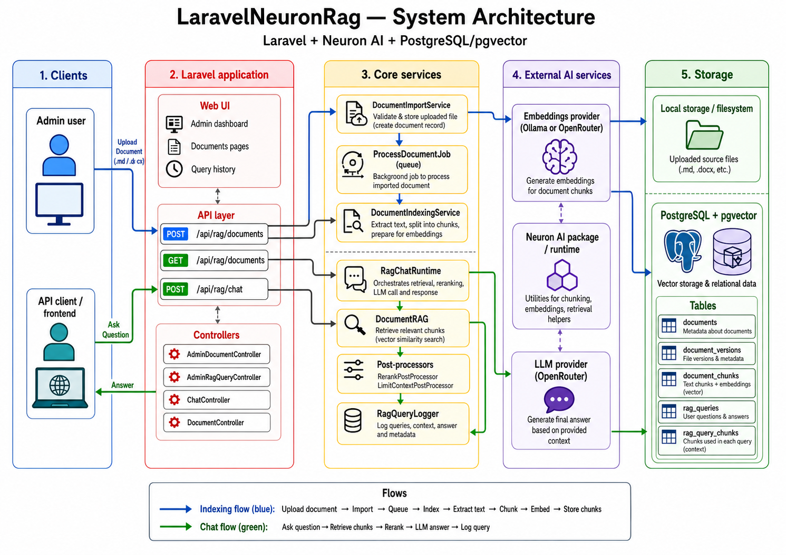
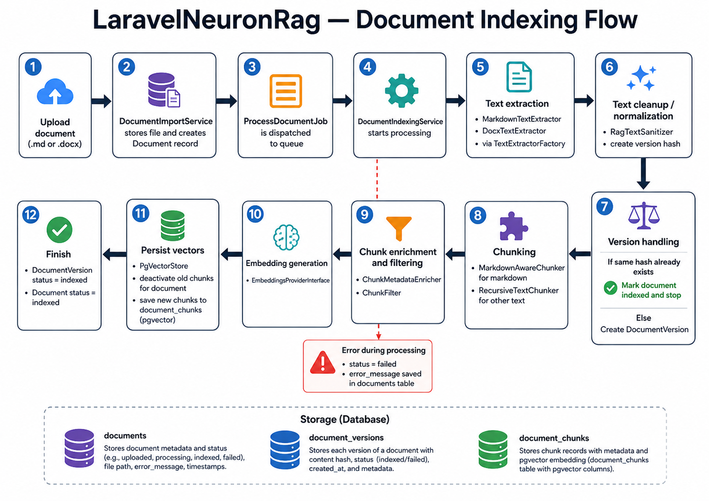
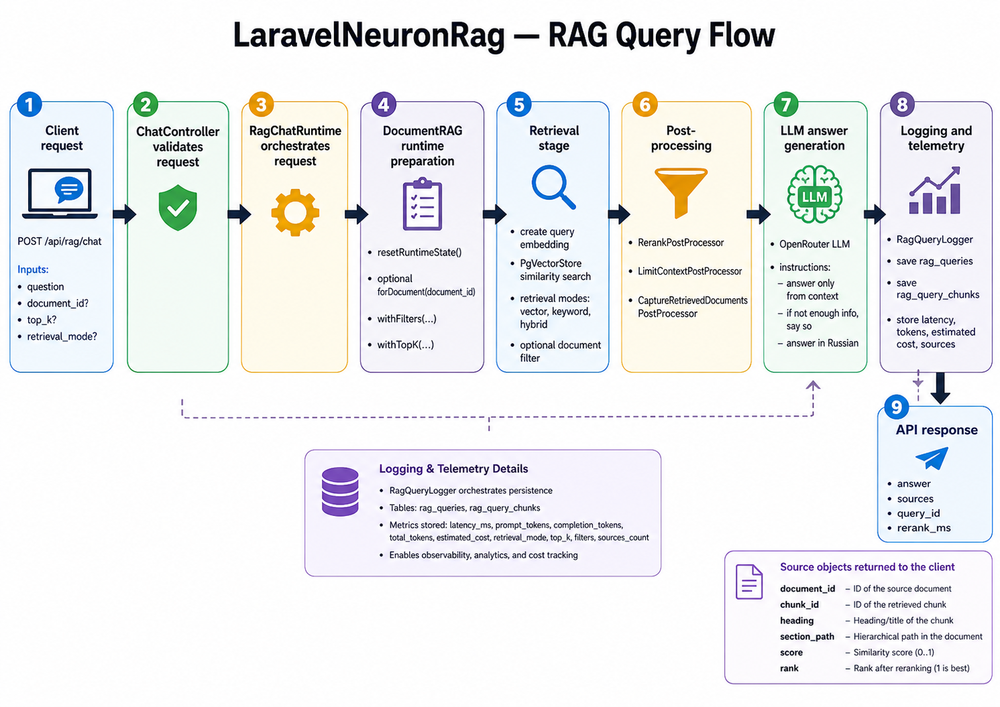

# LaravelNeuronRag

LaravelNeuronRag — учебно-практический Laravel-проект, который показывает, как встроить RAG-подсистему в Laravel-приложение: загружать документы, извлекать из них текст, нарезать текст на осмысленные чанки, строить embeddings, сохранять их в PostgreSQL + pgvector и задавать вопросы к документам через LLM.

Основная мысль проекта: **сделать RAG не отдельным скриптом, а нормальной частью Laravel-приложения** — с API, админкой, очередями, сервисным слоем, логированием запросов, метриками, источниками ответа и возможностью переиндексации документов.



## Что умеет проект

Проект реализует полный цикл работы с документами:

1. Загрузка документов через API или админку: базово `.md/.docx`, и расширенные форматы через внешний `markitdown` (`pdf`, `xlsx`, `xls`, `html`, `htm`, `jpg`, `jpeg`, `png`, `webp`) при доступном `/health`.
2. Сохранение исходного файла в Laravel Storage.
3. Постановка документа в очередь на индексацию.
4. Извлечение текста из Markdown или DOCX.
5. Очистка и нормализация текста.
6. Разбиение текста на чанки.
7. Обогащение чанков метаданными: документ, версия, заголовок, путь раздела, номер чанка, hash, размер.
8. Генерация embeddings.
9. Сохранение чанков и векторов в PostgreSQL с pgvector.
10. Поиск релевантных чанков через `vector`, `keyword` или `hybrid` retrieval.
11. Rerank найденных чанков.
12. Ограничение размера контекста перед отправкой в LLM.
13. Генерация ответа через OpenRouter/OpenAI-like provider.
14. Логирование RAG-запроса, источников, токенов, стоимости и времени выполнения.
15. Просмотр документов, чанков, версий и истории запросов в админке.

## Технологии

- PHP 8.3+
- Laravel 13
- PostgreSQL 16
- pgvector
- Neuron AI / Neuron Laravel
- OpenRouter / OpenAI-like provider для LLM
- Ollama или OpenRouter-compatible provider для embeddings
- Laravel Queue
- Vite + Tailwind CSS
- PHPWord для `.docx`

## Как устроен проект

### 1. Веб-слой и API

Проект имеет два основных интерфейса:

- **Admin UI** — страницы `/admin`, `/admin/documents`, `/admin/rag-queries`, `/admin/integrations/markitdown`.
- **JSON API** — маршруты `/api/rag/documents`, `/api/rag/chat`, `/api/rag/capabilities`.

Основные API endpoints:

| Метод | URL | Назначение |
|---|---|---|
| `GET` | `/api/rag/documents` | список документов |
| `POST` | `/api/rag/documents` | загрузить документ |
| `GET` | `/api/rag/documents/{id}` | получить информацию о документе |
| `POST` | `/api/rag/documents/{id}/reindex` | поставить документ на переиндексацию |
| `POST` | `/api/rag/chat` | задать вопрос к базе документов |
| `GET` | `/api/rag/capabilities` | текущие доступные расширения и health markitdown |

### 2. Индексация документов

Загрузка документа не индексирует его сразу в HTTP-запросе. Контроллер сохраняет файл, создаёт запись `documents` и отправляет задачу `ProcessDocumentJob` в очередь.



Индексация выполняется сервисом `DocumentIndexingService`:

1. Документ переводится в статус `processing`.
2. Из файла извлекается текст.
3. Текст нормализуется.
4. Считается hash версии документа.
5. Если такая версия уже есть — повторная индексация не создаёт дубликаты.
6. Создаётся `DocumentVersion`.
7. Текст делится на чанки.
8. Чанки фильтруются и обогащаются метаданными.
9. Для чанков строятся embeddings.
10. Старые активные чанки документа деактивируются.
11. Новые чанки сохраняются в `document_chunks`.
12. Документ получает статус `indexed`.

Для Markdown используется отдельный `MarkdownAwareChunker`, который учитывает заголовки и путь раздела. Для других текстов используется `RecursiveTextChunker` с overlap.

### 3. RAG runtime и чат

Когда пользователь отправляет вопрос в `/api/rag/chat`, управление попадает в `RagChatRuntime`.


Внутренний поток выглядит так:

1. Принимается вопрос, `document_id`, `top_k` и `retrieval_mode`.
2. Runtime сбрасывает состояние RAG-объекта.
3. При наличии `document_id` поиск ограничивается конкретным документом.
4. В `PgVectorStore` выполняется поиск чанков.
5. В зависимости от режима используется:
   - `vector` — поиск по embedding distance;
   - `keyword` — полнотекстовый поиск PostgreSQL;
   - `hybrid` — объединение vector + keyword результатов с весами.
6. `RerankPostProcessor` переупорядочивает найденные чанки.
7. `LimitContextPostProcessor` ограничивает размер контекста.
8. `DocumentRAG` отправляет вопрос и найденный контекст в LLM.
9. Ответ и источники возвращаются клиенту.
10. `RagQueryLogger` сохраняет вопрос, ответ, источники, метрики, токены и примерную стоимость.

## Модель данных

Основные таблицы проекта:

| Таблица | Назначение |
|---|---|
| `documents` | загруженные документы и их текущий статус |
| `document_versions` | версии нормализованного текста документа |
| `document_chunks` | чанки документа, metadata, search vector и embedding |
| `rag_queries` | история RAG-запросов, ответы, модель, токены, latency, стоимость |
| `rag_query_chunks` | какие чанки были использованы в конкретном ответе |

## Быстрый старт

### 1. Клонировать проект

```bash
git clone https://github.com/Kozavochka/LaravelNeuronRag.git
cd LaravelNeuronRag
```

### 2. Подготовить `.env`

```bash
cp .env.example .env
```

Минимально важно проверить параметры PostgreSQL и AI-провайдеров:

```env
DB_CONNECTION=pgsql
DB_HOST=127.0.0.1
DB_PORT=5433
DB_DATABASE=rag_db
DB_USERNAME=rag_user
DB_PASSWORD=rag_password

OPENROUTER_API_KEY=your_openrouter_key
OPENROUTER_MODEL=openrouter/free

RAG_EMBEDDING_PROVIDER=openrouter
RAG_EMBEDDING_MODEL=nvidia/llama-nemotron-embed-vl-1b-v2:free
RAG_EMBEDDING_DIMENSIONS=1024
```

Если хочешь использовать локальные embeddings через Ollama, можно переключить provider:

```env
RAG_EMBEDDING_PROVIDER=ollama
OLLAMA_BASE_URL=http://127.0.0.1:11434
RAG_EMBEDDING_MODEL=bge-m3
RAG_EMBEDDING_DIMENSIONS=1024
```

И загрузить модель:

```bash
ollama pull bge-m3
```

### 3. Запустить PostgreSQL + pgvector

В проекте есть `docker-compose.yml` с образом `pgvector/pgvector:pg16`.

```bash
docker compose up -d
```

### 4. Установить зависимости

```bash
composer install
npm install
php artisan key:generate
```

### 5. Применить миграции

```bash
php artisan migrate
```

### 6. Запустить приложение

Вариант 1 — одной командой через composer script:

```bash
composer run dev
```

Вариант 2 — отдельными процессами:

```bash
php artisan serve
php artisan queue:listen --tries=1 --timeout=0
npm run dev
```

После запуска админка будет доступна по адресу:

```text
http://localhost:8000/admin
```

## Примеры использования API

### Загрузить документ

```bash
curl -X POST http://localhost:8000/api/rag/documents \
  -F "file=@/path/to/document.md"
```

Ответ вернёт `id`, `title`, имя файла, расширение и статус. После загрузки документ будет поставлен в очередь на индексацию.

### Проверить статус документа

```bash
curl http://localhost:8000/api/rag/documents/1
```

Возможные статусы:

- `uploaded` — документ загружен;
- `processing` — идёт индексация;
- `indexed` — документ проиндексирован;
- `failed` — при обработке произошла ошибка.

### Переиндексировать документ

```bash
curl -X POST http://localhost:8000/api/rag/documents/1/reindex
```

### Задать вопрос

```bash
curl -X POST http://localhost:8000/api/rag/chat \
  -H "Content-Type: application/json" \
  -d '{
    "question": "О чем этот документ?",
    "document_id": 1,
    "top_k": 5,
    "retrieval_mode": "hybrid"
  }'
```

`document_id` можно не передавать — тогда поиск будет идти по всем активным чанкам.

`retrieval_mode` может быть:

- `vector`
- `keyword`
- `hybrid`

## Настройки RAG

Основные настройки находятся в `config/rag.php` и читаются из `.env`.

### Документы

```env
RAG_DOCUMENTS_DISK=local
RAG_DOCUMENTS_DIRECTORY=rag/documents
RAG_MAX_UPLOAD_KB=10240
```

### Chunking

```env
RAG_CHUNK_SIZE_CHARS=3200
RAG_CHUNK_OVERLAP_CHARS=500
RAG_MIN_CHUNK_CHARS=200
RAG_MAX_CHUNKS_PER_DOCUMENT=500
```

### Retrieval

```env
RAG_RETRIEVAL_MODE=hybrid
RAG_TOP_K=8
RAG_VECTOR_CANDIDATES=30
RAG_KEYWORD_CANDIDATES=30
RAG_FINAL_TOP_K=5
RAG_VECTOR_WEIGHT=0.7
RAG_KEYWORD_WEIGHT=0.3
RAG_MAX_CONTEXT_CHARS=16000
```

### LLM

```env
RAG_LLM_PROVIDER=openrouter
OPENROUTER_API_KEY=your_key
OPENROUTER_BASE_URL=https://openrouter.ai/api/v1
OPENROUTER_MODEL=openrouter/free
```

## Где смотреть результат

### Админка

- `/admin` — dashboard с количеством запросов, latency p50/p95, токенами и стоимостью.
- `/admin/documents` — список документов, фильтры, статусы, количество версий и чанков.
- `/admin/documents/{id}` — карточка документа.
- `/admin/documents/{id}/chunks` — чанки документа.
- `/admin/documents/{id}/versions` — версии документа.
- `/admin/rag-queries` — история RAG-запросов.
- `/admin/rag-queries/{id}` — подробности запроса, источники и preview API-ответа.

### База данных

Для отладки полезно смотреть:

```sql
select id, title, status, content_hash from documents order by id desc;
select id, document_id, chunk_index, heading, section_path from document_chunks where is_active = true;
select id, question, llm_model, total_ms, total_tokens, estimated_cost_usd from rag_queries order by id desc;
```

## Важные детали реализации

### Документы версионируются

При индексации считается `sha256` от нормализованного текста. Если такая версия уже была создана, проект не создаёт новые чанки повторно.

### Старые чанки не обязательно удаляются физически

`PgVectorStore::deleteBy()` умеет деактивировать старые чанки через `is_active = false`, если такая колонка есть. Это удобно для истории и переиндексации.

### Hybrid retrieval

В `hybrid` режиме проект отдельно получает кандидатов из vector search и keyword search, затем объединяет их по weighted score:

```text
final_score = vector_weight * vector_score + keyword_weight * keyword_score
```

По умолчанию веса такие:

```env
RAG_VECTOR_WEIGHT=0.7
RAG_KEYWORD_WEIGHT=0.3
```

### Rerank простой, но расширяемый

Сейчас используется `SimpleKeywordReranker`: он добавляет вес, если токены вопроса встречаются в тексте чанка, заголовке или пути раздела. Контракт `RerankerInterface` позволяет заменить его на более сильный reranker.

### LLM ограничена контекстом

`LimitContextPostProcessor` не даёт отправить в LLM слишком большой контекст. Лимит задаётся через:

```env
RAG_MAX_CONTEXT_CHARS=16000
```

### Ответ должен быть grounded

`DocumentRAG` задаёт системные инструкции: отвечать только на основе найденного контекста, не выдумывать факты и перечислять использованные источники.

## Структура ключевых классов

```text
app/
├── Domain/
│   ├── Documents/
│   │   ├── Jobs/ProcessDocumentJob.php
│   │   └── Services/
│   │       ├── DocumentImportService.php
│   │       ├── Indexing/DocumentIndexingService.php
│   │       ├── TextExtraction/MarkdownTextExtractor.php
│   │       ├── TextExtraction/DocxTextExtractor.php
│   │       └── TextProcessing/
│   │           ├── MarkdownAwareChunker.php
│   │           ├── RecursiveTextChunker.php
│   │           ├── ChunkMetadataEnricher.php
│   │           └── ChunkFilter.php
│   └── Rag/
│       ├── PostProcessors/
│       │   ├── RerankPostProcessor.php
│       │   └── LimitContextPostProcessor.php
│       ├── Services/
│       │   ├── RagChatRuntime.php
│       │   ├── RagQueryLogger.php
│       │   ├── SimpleKeywordReranker.php
│       │   └── CostEstimator.php
│       └── Support/RagRuntimeConfig.php
├── Http/Controllers/
│   ├── Admin/
│   └── Rag/
├── Models/
│   ├── Document.php
│   ├── DocumentVersion.php
│   ├── DocumentChunk.php
│   ├── RagQuery.php
│   └── RagQueryChunk.php
└── Neuron/
    ├── DocumentRAG.php
    └── VectorStore/PgVectorStore.php
```

## Возможные направления развития

- Добавить авторизацию для API и админки.
- Добавить поддержку PDF/HTML/TXT.
- Добавить streaming-ответы для чата.
- Заменить простой reranker на cross-encoder или LLM-reranker.
- Добавить отдельные коллекции документов или пространства знаний.
- Добавить оценку качества retrieval: hit rate, MRR, precision@k.
- Добавить UI-чата поверх `/api/rag/chat`.
- Вынести RAG-сервис в отдельный модуль или пакет для переиспользования в других Laravel-проектах.

## Кратко

LaravelNeuronRag — это пример того, как можно построить RAG внутри Laravel: не только вызвать LLM, а создать полноценный контур загрузки документов, индексации, поиска, генерации ответа, логирования и диагностики.
